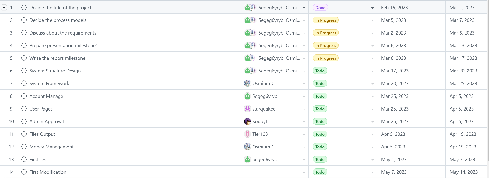

# [CS304] Requirement Analysis Report

## 1. Overview 

### 1.1 Motivation and Background 

This fund management system is mainly to achieve a user information processing and management system. In teachers' daily work and scientific research, they need to constantly apply for and manage funds. So our task is to design a fund application and management system to help teachers deal with related tasks efficiently and conveniently.

### 1.2 Target User or Clients Characteristics 

The users of our system are mainly university teachers and fund approvers. These users have the following characteristics: 1. Representativeness. Teachers usually have their own research groups, which need to apply for funding on behalf of the whole research group. 2. Timeliness. Teachers want grant applications reviewed as soon as possible.

### 1.3 Project Scope

This system mainly takes the teacher who applies for the management fund as the user, and the auditor who reviews the fund as the manager, which is temporarily applied in Southern University of Science and Technology.

### 1.4 Overall Goal 

To register the teacher as a user, the user has the attributes of the research group to which he belongs. If the user runs multiple research groups, he can view the information/forms of these research groups, and then maintain his fund balance, fund application, etc. At the same time, record the fund utilization rate and other information of the project he applied for. The approver, as the administrator, should be able to decide whether the application form is approved or not, if it is not approved, go back to the application to modify it, and if it is approved, check whether the application is complete.

## 2. Development Process

### 2.1 Process Models

#### Incremental Process Models

We decided to use Incremental Process Models as our development process model. 
Our project is designed to split into multiple parts and each part can be a waterfall. Compared with other models, it's easier to get users' feedback and easier to design and debug in each small function part. By using this model, more rapid delivery and deployment of useful software is available. Also it is particularly useful when staffing is unavailable for a complete implementation

### 2.2 Project Schedule

## 3. Suggested Deliverables

### 3.1 Milestone 2 Deliverable

Basic vue and springboot structure of the system. Also include functional requirement 1(Account Management) and functional requiremnet 2 (Funding Application).

### 3.2 Milestone 3 Deliverable

Whole vue and springboot structure code. Document of the funding system history and operation. And the test suites of our system passed.

## 4. Requirements

### 4.1 Functional Requirements

#### 4.1.1 Account Management

Input: 
Account number/User name; Key

Processing: 
Verify whether the password is correct; Distinguish between administrator accounts and user accounts

Output:
Display login results and account type

Description:
Ensure that users can normally use their own permission type of account and ensure their account security.

#### 4.1.2 Funding Application

Input: 
Account number; Applicant name; Application category; Number of funds applied.

Processing: 
Combine appliction data as application table and upload to database.

Output:
Funding application history.

Description:
It collects all the information the funding approval needs and store it into the database.

#### 4.1.3 Funding Approval

Input:
Select funding entry.

Process:
Show details of this entry for user to do dicision.

Output:
Funding entry approval result.

Description:
Each funding entry needs a manager to dicide if it is valid. This function is for manager to check the funding entrys.

#### 4.1.4 Form Output

Input: 
The type and range of the output form.

Process:
Read the data in the database of the system, calculate the result and output to a form.

Output:
The form stores the result.

Description:
Users can call up the required statistics form according to their own permissions

#### 4.1.5 Funding Management

Input: 
Funding distribution; Funding cost.

Processing: 
Show the detailed users' funding management to help users manage their funding.

Output:
Funding management table.

Description:
Users need the system to help them record the condition of funding distribution and cost.

### 4.2 Non-Functional Requirements

#### 4.2.1 Quality requirements 

Quality attributes include reliability(capabilities of providing correct and continuous operation results), test (tested easily), easy of use, execution speed, reliability, exception processing, and other related attributes.) 

##### 4.2.1.1 System Stability for Undefined Input: 

The system needs to keep running when some user performs not as we expected. That is, whenever some user clicked anything, the data and running status should be good. So we should add the instructions of how to use our system. Meanwhile, we need to test our system many times in milestone 3 to check our system stability.

##### 4.2.1.2 Testability:

The system is based on the incremental model. So the system can be divided into several functional parts and be tested independently.

#### 4.2.1.3 Easy to Use

Each function of this system should be clear to use. There should not be confusing options. The output of each function should be easily visible.

#### 4.2.2 Safety Requirements

##### 4.2.2.1 Safety

The system needs to be able to safely save the user's password and other information, which could avoid data loss and data safety.

##### 4.2.2.2 User Privacy

User privacy needs to be guaranteed, that is, each user can only see the information and data that conform to his authority. For example, administrators can see everyone's information because of their higher privileges, while ordinary users can only see information about themselves.

## 5. Constraints

### 5.1 Operation Environment 

For using, it is a webpage can open in a browser. It should be acting well in a computer.

For deployment, it can be running in both linux and windows operating system.

### 5.2 Design and Implementation 

We split this system into frontend and backend. The frontend will be using vue, and the backend should be using springboot. Both can be running on linux and windows.

(constraints related to the system design and implementation. Specify the type of the platform and the development language and tools.